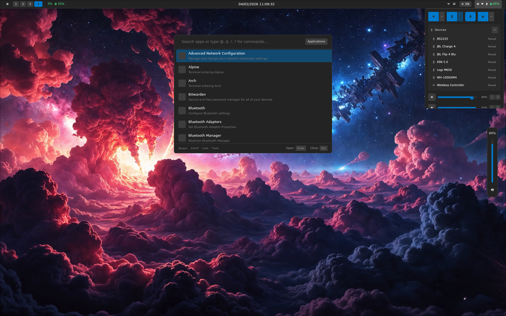
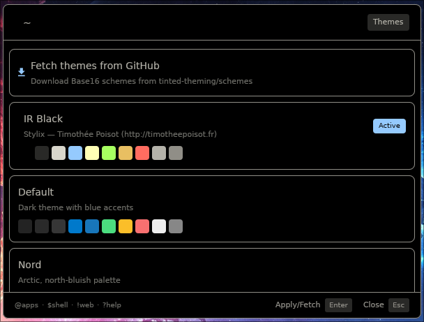
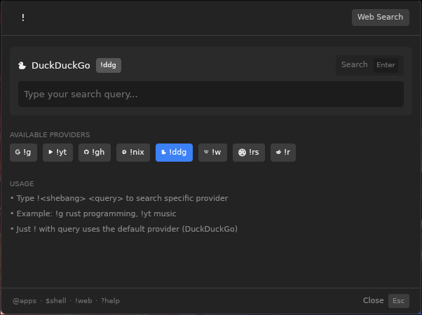

# GPUi shell (Placeholder name)

## In Development

This project is currently in active development and is not yet stable for
production use. Expect frequent changes, bugs, and incomplete features. Your
contributions and feedback are welcome!

## Features

- OSD (Volume + Brightness)
- Launcher with multiple views
- Bar with control center and widgets
- (Planned) bottom dock
- (Planned) configuration files/menu
- (Planned) notification module (replace swaync)
- (Planned) custom launcher views/ bar widgets







## Known Issues

- Scroll on launcher
- Mouse interactions missing
- Control center interactions missing

## Installation

### NixOS

Add the shell as a flake input and the default package to the user/environment
packages.

```nix
{
  inputs = {
    shell.url = "github:andre-brandao/gpuishell";
  };
}
```

```nix
{inputs, pkgs, ...}:{
  # NixOS
  environment.systemPackages = [ inputs.shell.packages.default ];
  # Home Manager
  home.packages = [ inputs.shell.packages.default ];
}
```

### Usage

```hyprconf
exec-once gpuishell

bindr = SUPER, SUPER_L, exec, gpuishell
```

```bash
# Calling again will open the launcher
gpuishell

# Prefill input to open a custom provider
gpuishell -i "~"
```

## Thanks

- [zed](https://github.com/zed-industries/zed): rendering and ui design (gpui).
- [gpui-component](https://github.com/longbridge/gpui-component): ui code copied
  from here.
- [mgs](https://github.com/wuliuqii/mgs): For the initial idea and inspiration.
- [ashell](https://github.com/MalpenZibo/ashell): For the initial idea and
  inspiration.

## My other attempts

- [iced-shell](https://github.com/andre-brandao/icedshell): A shell written in
  Rust using the iced framework. (i did not like iced that much)
- [svelte-shell](https://github.com/andre-brandao/tauri-shell): A shell written
  using Tauri + Svelte. (Too slow)

And some others that are not on github using [ags](https://aylur.github.io/ags/)
or [quickshell](https://github.com/quickshell-mirror/quickshell)
