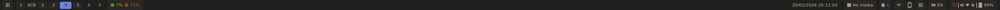
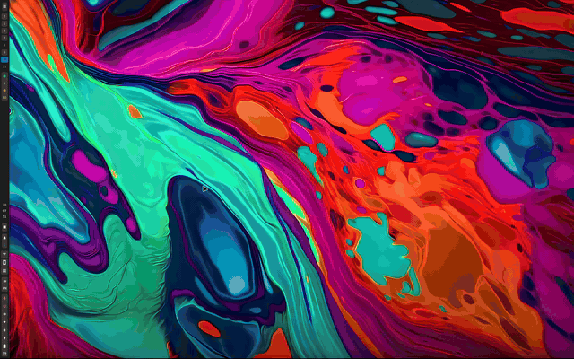

# GPUi Shell (Placeholder name)

A Wayland desktop shell built with GPUI (Zed's UI framework) in Rust. Provides a
system bar, command launcher, and control center for Hyprland and Niri
compositors.

## Scope

GPUi Shell aims to be a lightweight, modular desktop shell replacing components
like waybar, swaync, rofi/walker, and wlogout. It integrates deeply with Linux
desktop ecosystems via D-Bus while providing a modern, GPU-accelerated UI.

## Features

### Bar & Widgets

- **Wayland layer-shell** status bar (top/bottom/left/right)
- **Workspaces** — workspace switcher with click to switch
- **Active Window** — shows focused window title
- **System Tray** — D-Bus system tray integration (libtray)
- **Clock** — configurable datetime display
- **Keyboard Layout** — current keyboard layout indicator
- **Battery** — battery percentage and charging status
- **SysInfo** — CPU/memory overview widget

### Launcher

- **Command launcher** with prefix-based view routing
- **Apps** — application search and launcher (freedesktop desktop files)
- **Shell** — run shell commands
- **Workspaces** — workspace management
- **Theme** — switch between light/dark and accent colors
- **Wallpaper** — set desktop wallpaper
- **Web** — quick web search
- **Help** — keyboard shortcuts reference

### Control Center

- **Audio** — volume control with PulseAudio (libpulse-binding)
- **Brightness** — screen brightness control
- **Network** — WiFi/Bluetooth toggle via NetworkManager (libnm)
- **Bluetooth** — device pairing and connection (bluez)
- **Power** — battery status and session power actions (UPower)
- **Notifications** — notification center with Do Not Disturb
- **Media** — MPRIS media player controls

### OSD (On-Screen Display)

- Volume and brightness indicators on key press

### System Integration

- **Compositor abstraction** — auto-detects Hyprland or Niri
- **Single-instance** — running again opens launcher (via socket)
- **Privacy mode** — temporarily disable screenshare/camera indicators
- **Applications** — desktop file parsing and icon loading

## Showcase

## Documentation

Full documentation is available at **https://andre-brandao.github.io/gpui-shell/**

- [Installation](https://andre-brandao.github.io/gpui-shell/guides/installation/)
- [Configuration](https://andre-brandao.github.io/gpui-shell/reference/configuration/)

## Thanks

- [zed](https://github.com/zed-industries/zed): rendering and ui design (gpui).
- [gpui-component](https://github.com/longbridge/gpui-component): ui code copied
  from here.
- [mgs](https://github.com/wuliuqii/mgs): For the initial idea and inspiration.
- [ashell](https://github.com/MalpenZibo/ashell): For the initial idea and
  inspiration.

## My other attempts

- [iced-shell](https://github.com/andre-brandao/icedshell): A shell written in
  Rust using the iced framework. (i did not like iced that much)
- [svelte-shell](https://github.com/andre-brandao/tauri-shell): A shell written
  using Tauri + Svelte. (Too slow)

And some others that are not on github using [ags](https://aylur.github.io/ags/)
or [quickshell](https://github.com/quickshell-mirror/quickshell)
